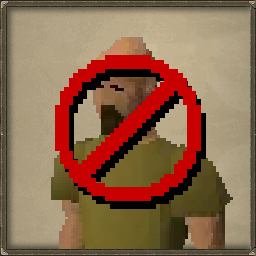

# Maya's Chat Filter

## Description

Get rid of spam bots around Oldschool Runescape worlds.

## Features

- Automatically fetches and updates the filters from github.

## Installation

1. Open the RuneLite client.
2. Go to the Plugin Hub panel.
3. Search for "Maya's Chat Filter" and install the plugin.

## License

[MIT License](LICENSE)
